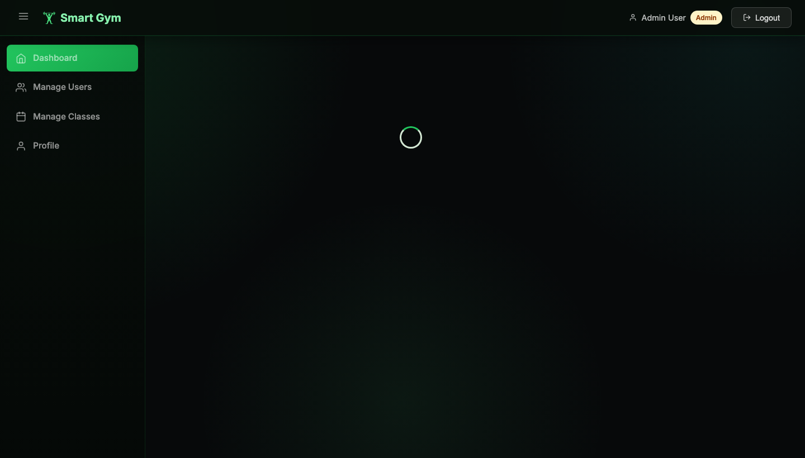
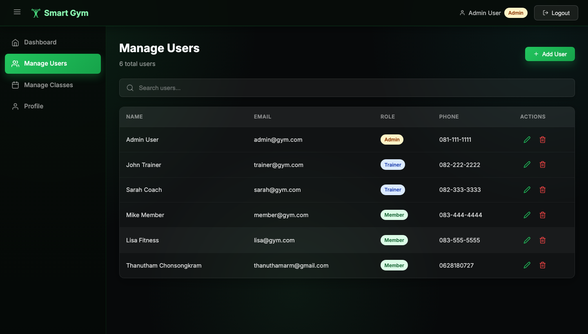
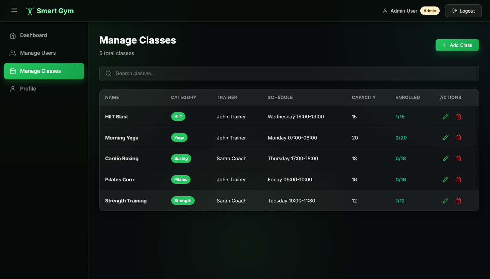
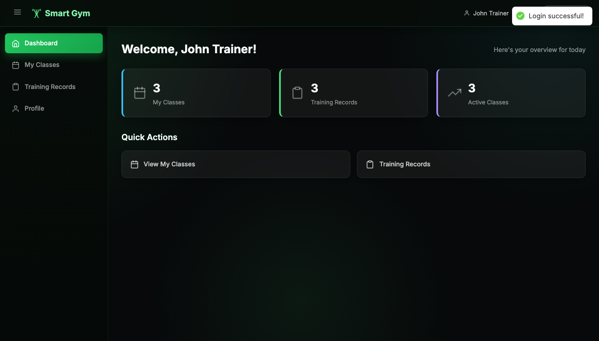
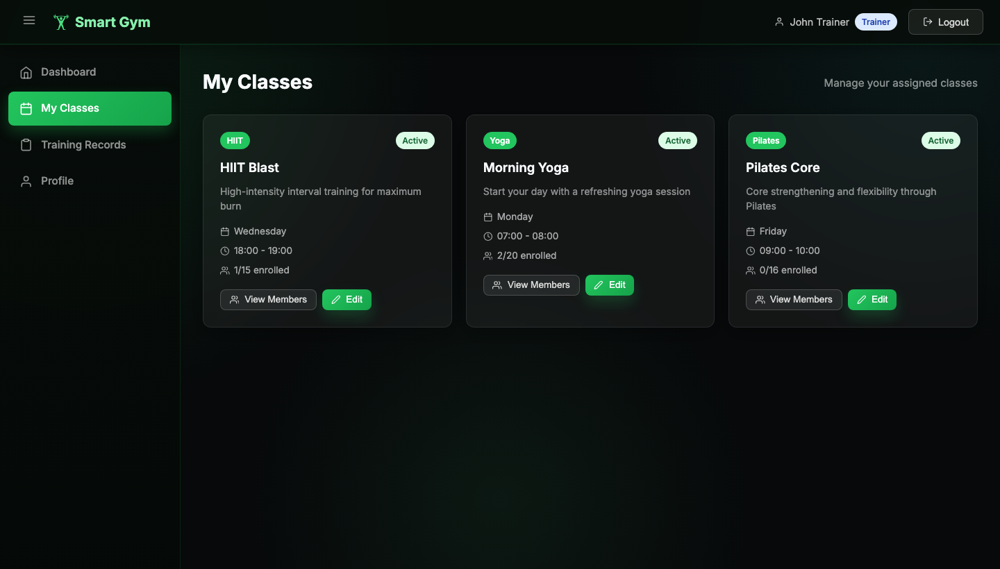
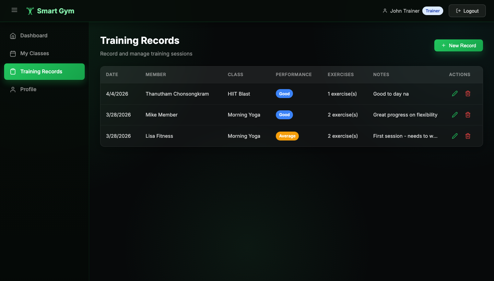
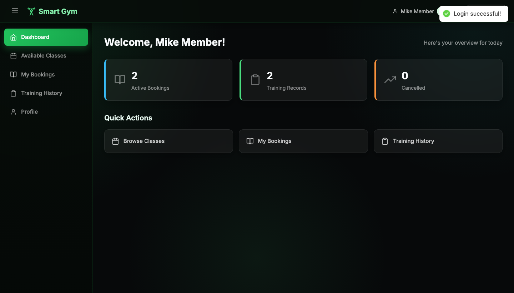
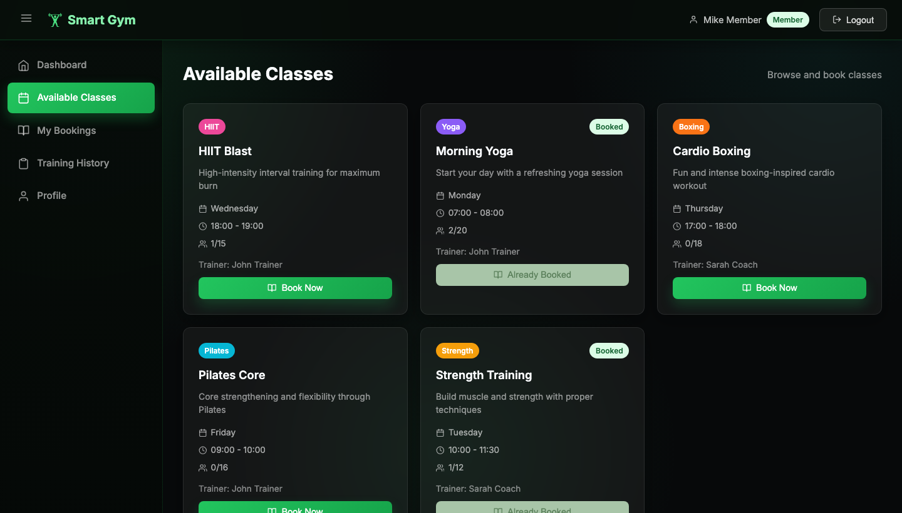
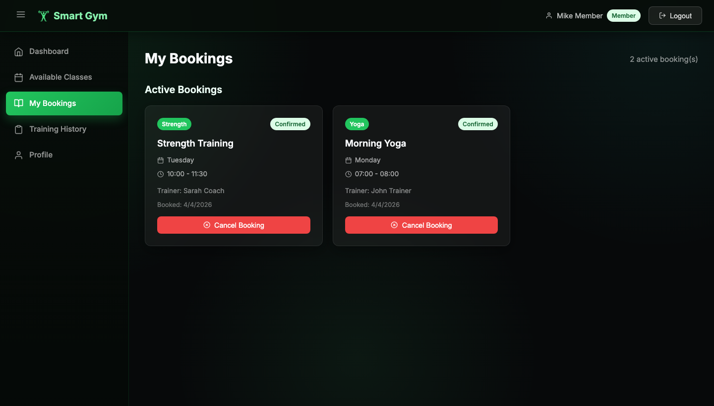
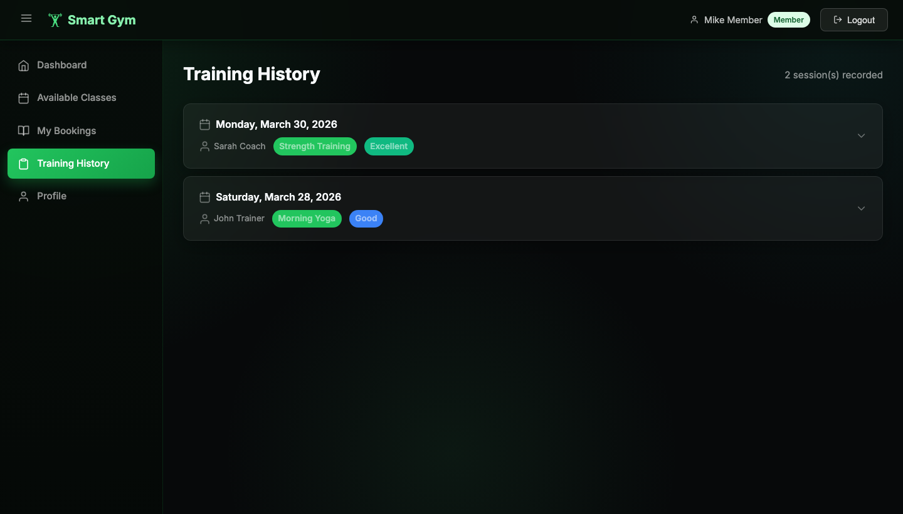

# Smart Gym Management System

A web-based gym management system that helps manage members, trainers, and workout classes. Built with React, Node.js, Express, and MongoDB.

## Features

- **Authentication System**: Registration, login/logout with JWT & bcrypt
- **Role-Based Access Control**: Admin, Trainer, Member roles
- **Class Management**: Create, update, delete gym classes
- **Booking System**: Members can book/cancel classes with capacity limits
- **Training Records**: Trainers record sessions, members view history
- **Full CRUD Operations**: Based on user roles

## Tech Stack

| Layer          | Technology              |
|----------------|-------------------------|
| Frontend       | React + Vite            |
| Backend        | Node.js + Express       |
| Database       | MongoDB + Mongoose      |
| Authentication | JWT (JSON Web Token)    |
| Password Hash  | bcrypt                  |

## Prerequisites

- **Node.js** v18+
- **MongoDB** (running locally or MongoDB Atlas)
- **npm** or **yarn**

## Getting Started

### 1. Clone the repository

```bash
git clone https://github.com/Skiffet/Smart-Gym-Management-System.git
cd Smart-Gym-Management-System
```

### 2. Setup Backend

```bash
cd backend
npm install
```

Configure environment variables in `backend/.env`:

```
PORT=5000
MONGO_URI=mongodb://localhost:27017/smart-gym
JWT_SECRET=your_jwt_secret_key_here
```

### 3. Setup Frontend

```bash
cd frontend
npm install
```

### 4. Seed Demo Data (Optional)

```bash
cd backend
npm run seed
```

This will create demo accounts:

| Role    | Email            | Password    |
|---------|------------------|-------------|
| Admin   | admin@gym.com    | password123 |
| Trainer | trainer@gym.com  | password123 |
| Trainer | sarah@gym.com    | password123 |
| Member  | member@gym.com   | password123 |
| Member  | lisa@gym.com     | password123 |

### 5. Run the Application

**Backend** (Terminal 1):
```bash
cd backend
npm run dev
```

**Frontend** (Terminal 2):
```bash
cd frontend
npm run dev
```

- Frontend: http://localhost:3000
- Backend API: http://localhost:5000

## API Endpoints

### Auth
- `POST /api/auth/register` - Register new member
- `POST /api/auth/login` - Login
- `GET /api/auth/me` - Get current user
- `PUT /api/auth/profile` - Update profile

### Users (Admin only)
- `GET /api/users` - Get all users
- `POST /api/users` - Create user
- `PUT /api/users/:id` - Update user
- `DELETE /api/users/:id` - Delete user
- `GET /api/users/trainers` - Get all trainers
- `GET /api/users/members` - Get all members

### Classes
- `GET /api/classes` - Get all classes
- `POST /api/classes` - Create class (Admin)
- `PUT /api/classes/:id` - Update class (Admin/Trainer)
- `DELETE /api/classes/:id` - Delete class (Admin)
- `GET /api/classes/my-classes` - Get trainer's classes

### Bookings
- `POST /api/bookings` - Create booking (Member)
- `GET /api/bookings/my-bookings` - Get my bookings (Member)
- `PUT /api/bookings/:id/cancel` - Cancel booking (Member)
- `GET /api/bookings/all` - Get all bookings (Admin)
- `GET /api/bookings/class/:classId` - Get class bookings

### Training Records
- `POST /api/training-records` - Create record (Trainer)
- `GET /api/training-records/trainer` - Get trainer's records
- `GET /api/training-records/member` - Get member's records
- `PUT /api/training-records/:id` - Update record (Trainer)
- `DELETE /api/training-records/:id` - Delete record

## Screenshots

### Public Pages

| Home | Login | Register |
|------|-------|----------|
|  |  |  |

### Admin Role

| Dashboard | Manage Users | Manage Classes |
|-----------|--------------|----------------|
|  |  |  |

### Trainer Role

| Dashboard | My Classes | Training Records |
|-----------|------------|-----------------|
|  |  |  |

### Member Role

| Dashboard | Available Classes | My Bookings | Training History |
|-----------|-------------------|-------------|-----------------|
|  |  |  |  |

## Project Structure

```
Smart-Gym-Management-System/
├── backend/
│   ├── config/         # Database configuration
│   ├── controllers/    # Route handlers
│   ├── middleware/      # Auth & role middleware
│   ├── models/         # Mongoose schemas
│   ├── routes/         # API routes
│   ├── seed.js         # Database seeder
│   └── server.js       # Entry point
├── frontend/
│   └── src/
│       ├── api/        # Axios configuration
│       ├── components/ # Shared components
│       ├── context/    # Auth context
│       └── pages/      # Page components
│           ├── admin/
│           ├── trainer/
│           └── member/
└── README.md
```
